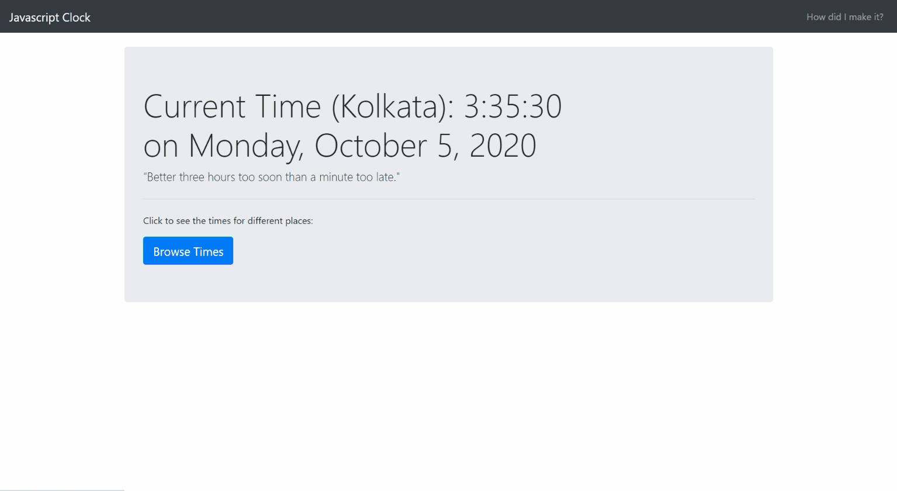

### Contents

* [Count clicks](https://anubhavbagri.github.io/javascript-projects/Count%20clicks/index.html)
* [Digital Clock](https://anubhavbagri.github.io/javascript-projects/javascript%20clock/index.html)
* [To Do List](https://anubhavbagri.github.io/javascript-projects/js%20to-do%20list/index.html)
* [Basic Calculator](https://anubhavbagri.github.io/javascript-projects/basic-calculator/index.html)
* [Snake Game](https://anubhavbagri.github.io/javascript-projects/snake-game/snake.html)
* [Acknowledgements](#acknowledgements)

---

## Digital Clock



Made this digital browser clock using vanilla javascript by referring to [code with harry](https://codewithharry.com/videos/javascript-tutorial-in-hindi-in-one-video-2020) javascript tutorial which uses ```Date()``` object and their methods to show the time. It also shows times ⏳ of different cities of the world 🌍  

## To Do List


Made this browser to do list using vanilla javascript by referring to [code with harry](https://codewithharry.com/videos/javascript-tutorial-in-hindi-in-one-video-2020) javascript tutorial which uses ```localStorage()``` to store the item title and its description. Also added a search feature in the nav bar to easily search any task in the list. If you want to add any other feature and contribute to the repository, you can create a pull request 😉 I will be more than happy to merge it!  

## Acknowledgements

* [**Bootstrap**](https://getbootstrap.com/)
* [**StackOverflow**](https://stackoverflow.com/)
* [**MDN Web Docs**](https://developer.mozilla.org/en-US/docs/Web/JavaScript)
